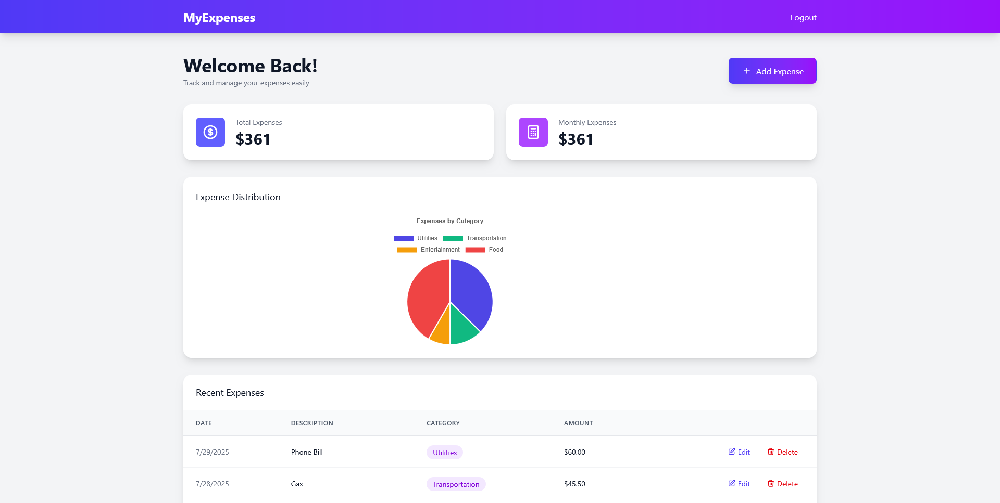

# MyExpenses - Personal Expense Tracker

<p align="center">
  
</p>

<p align="center">
    <a href="#features">Features</a> •
    <a href="#installation">Installation</a> •
    <a href="#tech-stack">Tech Stack</a> •
    <a href="#contributing">Contributing</a>
</p>

[](https://laravel.com)
[](LICENSE)
[](http://makeapullrequest.com)

## About MyExpenses

MyExpenses is a modern, user-friendly personal expense tracking application built with Laravel and Vue.js. It helps users manage their finances by providing an intuitive interface to track, categorize, and analyze their expenses. With beautiful visualizations and a clean interface, MyExpenses makes financial management a breeze.

## Features

- 📊 **Dashboard Overview**: Get a quick glance at your total and monthly expenses
- 📈 **Expense Distribution**: Visual breakdown of expenses by category
- 🏷️ **Category Management**: Organize expenses with customizable categories
- 📱 **Responsive Design**: Works seamlessly on desktop and mobile devices
- 🔄 **Real-time Updates**: Instant updates when adding or modifying expenses
- 📅 **Date Tracking**: Keep track of when expenses occur
- 🔍 **Expense History**: View and manage your recent expenses
- ✏️ **Edit & Delete**: Full control over your expense entries

## Installation

1. Clone the repository
```bash
git clone https://github.com/mabdusshakur/MyExpenses.git
```

2. Install PHP dependencies
```bash
composer install
```

3. Install NPM dependencies
```bash
npm install
```

4. Create environment file
```bash
cp .env.example .env
```

5. Generate application key
```bash
php artisan key:generate
```

6. Configure your database in `.env`

7. Run migrations and seeders
```bash
php artisan migrate --seed
```

8. Start the development server
```bash
php artisan serve
npm run dev
```

## Tech Stack

### Backend
- [Laravel 12.x](https://laravel.com) - PHP Framework
- [MySQL](https://www.mysql.com) - Database
- [Inertia.js](https://inertiajs.com) - Modern Single Page Application (SPA) Framework

### Frontend
- [Vue.js 3](https://vuejs.org) - Frontend Framework
- [Tailwind CSS](https://tailwindcss.com) - CSS Framework
- [Chart.js](https://www.chartjs.org) - Charts and Visualizations

## Contributing

Contributions are what make the open-source community such an amazing place to learn, inspire, and create. Any contributions you make are **greatly appreciated**.

1. Fork the Project
2. Create your Feature Branch (`git checkout -b feature/AmazingFeature`)
3. Commit your Changes (`git commit -m 'Add some AmazingFeature'`)
4. Push to the Branch (`git push origin feature/AmazingFeature`)
5. Open a Pull Request

## License

Distributed under the MIT License. See `LICENSE` for more information.

## Contact

Shakur - [mabdusshakur12@gmail.com](mailto:mabdusshakur12@gmail.com)

Project Link: [https://github.com/mabdusshakur/MyExpenses](https://github.com/mabdusshakur/MyExpenses)

## Acknowledgments

- [Laravel](https://laravel.com)
- [Vue.js](https://vuejs.org)
- [Tailwind CSS](https://tailwindcss.com)
- [Chart.js](https://www.chartjs.org)
